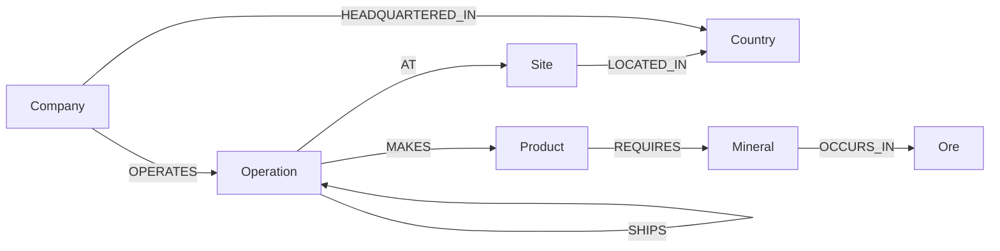
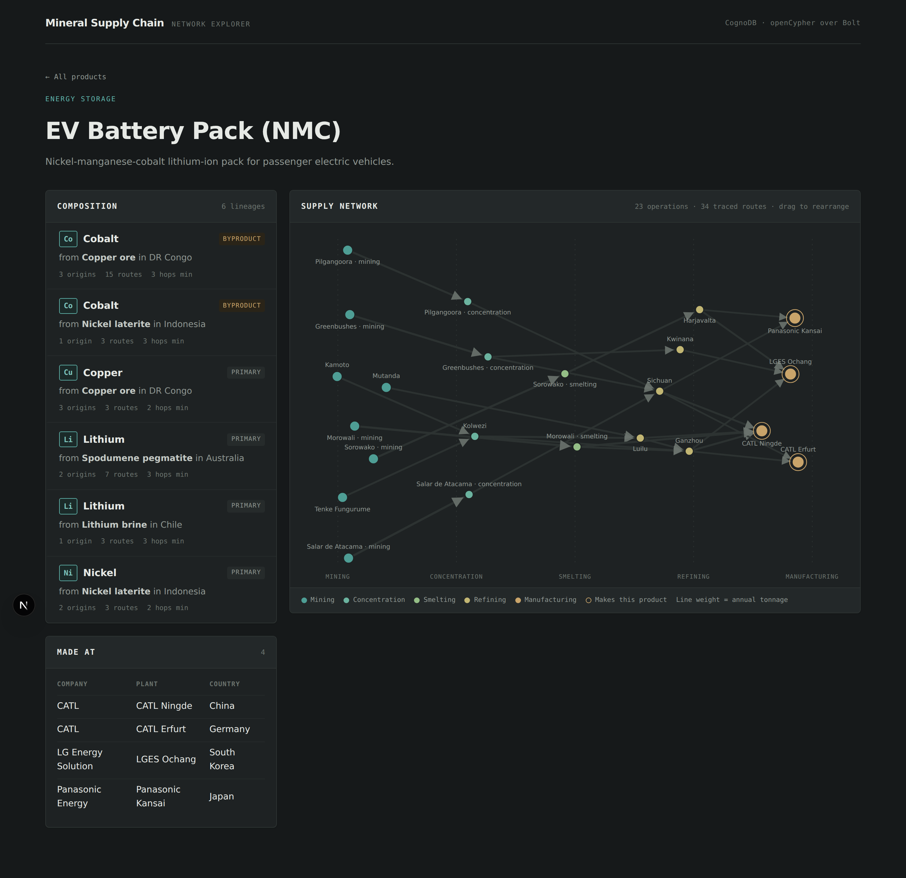

# Mineral Supply Chain Network

Trace the critical minerals in a finished product back to the orebody they came from, and work out what stops when one link in the chain fails.

Built on CognoDB, a managed graph database that speaks openCypher over Bolt.


## The use case

An electric vehicle battery contains cobalt, nickel, lithium and copper. None of those arrive as metal. They come out of the ground as ore, get concentrated, smelted and refined through a chain of facilities in different countries, and only then reach a battery plant. By the time the pack is assembled, the material has passed through four or five separate companies on three continents.

The questions people actually ask about that chain are questions about routes:

* Where did the cobalt in this battery come from?
* If Congo restricts exports next month, which products stop?
* Which single facility, if it went offline, would break the most supply lines?

None of those can be answered by looking at one row of anything. They are answered by walking the connections, and that is what this application does.

I picked this domain because I have a First Class B.Tech in Mining Engineering from FUTA, so I can defend the data model from what actually happens in a plant rather than from a diagram I copied.

### The framing decision that shaped everything

This models the **network**, not the inventory.

The graph records which supply routes exist and how much flows along them. It does not attempt to track individual batches. That is deliberate. Material is commingled and blended at every refining stage, so there is no atom level lineage to recover, and pretending otherwise would build precision into the app that does not exist in the world. The industry accounts at flow level and the public data exists at flow level, so the model does too.

Think of it like an airline route network. You model airports and routes with capacities, not individual passengers, and you can still answer everything worth asking.

## Why a graph database

The honest version of this answer has two halves, because not every screen in this app needs a graph.

### The part a relational database could do, awkwardly

Product composition walks from a mining operation to a factory. The number of hops varies between two and seven depending on the route, so in SQL it is a recursive CTE. It works, it is just unpleasant to read and unpleasant to change.

### The part that is genuinely hard without one

Three findings from the seeded data, none of which are stored anywhere and all of which only exist as properties of how paths overlap.

**Cobalt reaches the same battery by two completely separate lineages.** Fifteen routes carry cobalt recovered as a byproduct of Congolese copper ore. Three carry cobalt recovered from Indonesian nickel laterite. Same element, different geology, different recovery process, different political exposure. A production table records "cobalt" once. Only the paths tell you there are two supply lines and that one of them survives if the other is cut.

**A Congo export restriction cuts a product that contains no cobalt.** Filter products by "requires cobalt" and you get the NMC pack. But Luilu, in Congo, is the only copper refinery reaching any plant in this graph, and the LFP pack requires copper. So the LFP pack stops dead while the NMC pack's cobalt is only *thinned*, because its Indonesian line keeps running. Wrong product, wrong mineral, wrong severity. The right answer comes from asking which operations sit in that country and what lies downstream of them, which is a question about nodes in the middle of the chain that no product and no mine has a direct relationship with.

**Every gram of cobalt in the graph passes through one refinery.** Ganzhou sits on 18 of 43 traced routes, taking from both the Congolese and Indonesian lineages before splitting out to three of the four battery plants. Take it offline and all cobalt supply stops at once, from both sources. That fact is written nowhere in the data. It appears only when you count how many origin to product paths run through each node.

That third one is the clearest case. There is no table you can add that answers it, because the answer changes the moment anyone reroutes a shipment.

## Data model

Five node labels and eight relationship types.



| Label | What it is | Key properties |
|---|---|---|
| `Site` | A physical place | `id`, `name` |
| `Operation` | One process unit at a site | `id`, `type`, `capacity`, `status` |
| `Company` | The legal entity | `id`, `name`, `hq_country` |
| `Ore` | What comes out of the ground | `id`, `name`, `description` |
| `Mineral` | The recovered metal | `id`, `name`, `symbol`, `criticality` |
| `Product` | The finished good | `id`, `name`, `category` |
| `Country` | Jurisdiction | `id` (ISO 3166-1 alpha-2), `name`, `region` |

`Operation.type` is one of `mining`, `concentration`, `smelting`, `refining`, `manufacturing`.

The `SHIPS` relationship carries `ores[]`, `minerals[]`, `form[]`, `tonnage` and a `stream_id`.

### Three decisions worth explaining

**A site and an operation are different things.** Kolwezi is a place. The concentrator at Kolwezi is a process unit. Greenbushes both mines and concentrates on the same ground, so it gets two `Operation` nodes and an internal `SHIPS` edge between them. Seven of the twenty two sites in the seed data work this way.

This buys three things. Origins become a one word rule, since `type: 'mining'` is always the start of a chain. Chokepoint analysis gets sharper, because in a real disruption it is usually one process unit that fails rather than a whole complex. And joint ventures with different ownership per unit are expressible, since `OPERATES` hangs off the operation rather than the site.

**A manufacturer is a company, not a kind of node.** Glencore, CMOC and CATL are all companies. They just run different kinds of sites. Merging them means "who makes this product" is derived by traversal rather than stored, which gives you the specific plant instead of just the company name. It also makes vertical integration askable: CMOC operates a mine, a concentrator and two refineries across Congo and China, which is the concentration that actually matters in critical minerals. Under separate `Mine` and `Manufacturer` labels there was no node type spanning them, so that question had nowhere to start.

**The ore travels the whole chain, the mineral does not.** This is the idea the whole model rests on.

When copper ore is processed, cobalt comes out. The mineral on a `SHIPS` edge changes at the concentrator. But the *ore it came from* never changes. So provenance is an intersection of the ore lists along every leg of a path, not a rule about which mineral transitions are allowed:

```cypher
reduce(acc = head(relationships(path)).ores, r IN relationships(path) |
       [x IN acc WHERE x IN r.ores]) AS lineageOres
```

That one line handles blending for free. Ganzhou takes Congolese copper ore cobalt and Indonesian nickel laterite cobalt and ships one stream onward carrying both ores. Its outbound edge accepts both traces, but the leg into it from Kolwezi carries only copper ore, so the intersection for that path is copper. The upstream legs do the discriminating and no special case is needed.

## The queries

Every query lives in `lib/queries.ts` as a named constant. The Cypher is never built by string concatenation, and every value arrives through a parameters object.

### Product composition

Given a product, which minerals does it contain and where did they originate. Returns one row per `(mineral, ore)` lineage rather than per mineral, because cobalt from Congolese copper ore and cobalt from Indonesian nickel laterite are different supply lines and collapsing them would throw away the distinction the model exists to capture.

The bill of materials is collected first and applied as a path predicate before the unwinds, so paths delivering nothing the product needs are cut before they multiply out into rows.

### Route listing

The same traversal, returned as individual chains rather than aggregated. Hovering a route in the interface spotlights exactly its links in the graph.


This exists because "15 routes" is accurate but abstract. Fifteen distinct paths run over only nine distinct links, since routes overlap heavily, and there is no way to count them by eye. Grouping the list by origin makes all three summary numbers legible at once: three origin groups, six plus three plus six routes, shortest chain three hops.

### Country disruption

Given a country, what stops. A route counts as affected if **any** operation on it sits in that country, not just its origin, because material merely refined there is cut too when exports stop.

The result splits into severed, where every route for a mineral runs through the country, and thinned, where some survive elsewhere. A binary affected or not affected answer would have reported Congo as catastrophic for cobalt when it is actually partial, and missed the copper cut entirely.


### Chokepoint ranking

Which intermediate operation carries the most origin to product routes. CognoDB does not ship a graph algorithms library, so there is no betweenness centrality to call. This unwinds the nodes of every traced path and counts, which at this graph size runs fast enough to serve on request.

Mining and manufacturing operations are excluded from the ranking. They always sit at the ends of their own paths, so including them would rank them meaninglessly high.

## What the data says

Seeded from the USGS Mineral Commodity Summaries 2026, using the 2025 estimated column for country level production. Operation level tonnages are plausible allocations rather than USGS figures, which is noted in the seed file.

The graph holds 91 nodes and 50 relationships: 22 sites, 30 operations, 13 companies, 13 countries, 5 ores, 5 minerals, 3 products, 35 shipping routes.

**EV Battery Pack (NMC)**, 34 traced routes across 23 operations:

| Mineral | From | Origin | Routes |
|---|---|---|---|
| Cobalt | Copper ore | DR Congo | 15 |
| Cobalt | Nickel laterite | Indonesia | 3 |
| Copper | Copper ore | DR Congo | 3 |
| Lithium | Spodumene pegmatite | Australia | 7 |
| Lithium | Lithium brine | Chile | 3 |
| Nickel | Nickel laterite | Indonesia | 3 |

**If DR Congo restricts exports:**

| Product | Mineral | Effect |
|---|---|---|
| EV Battery Pack (LFP) | Copper | Stops, 3 of 3 routes |
| EV Battery Pack (NMC) | Copper | Stops, 3 of 3 routes |
| EV Battery Pack (NMC) | Cobalt | Thinned, 15 of 18 routes |
| Everything else | | Unaffected |

**If China restricts exports**, five of the seven product and mineral lines stop completely, including all cobalt and all LFP lithium. China mines almost none of this material. It refines it.

**Chokepoints**, by share of the 43 traced routes passing through:

| Operation | Type | Country | Routes |
|---|---|---|---|
| Ganzhou | Refining | China | 18 of 43 (42%) |
| Kolwezi | Concentration | DR Congo | 16 of 43 (37%) |
| Luilu | Refining | DR Congo | 15 of 43 (35%) |
| Sichuan | Refining | China | 12 of 43 (28%) |

## Working with CognoDB

CognoDB implements a subset of Cypher, so I wrote a capability probe (`probe.mjs`) and ran it before writing the seed script rather than discovering the gaps thirty hours in. It creates its own throwaway labels, asserts on each capability, and deletes everything afterwards.

What it found:

**`MERGE` keyed on list valued relationship properties is not idempotent.** Two identical merges produce two edges. Left alone, this would have duplicated all 35 shipping routes on every re-seed and silently doubled every route count and every chokepoint percentage in the application. The seed script keys on a scalar `stream_id` built from the sorted lists instead, then writes the lists with `SET`. It also counts edges after writing and warns if the total ever exceeds the rows in the seed file.

**`any(x IN list WHERE predicate)` does not filter correctly.** A path predicate using it matched zero rows where the equivalent list comprehension matched two. Every membership test in the query file is written as `size([x IN list WHERE predicate]) > 0` for this reason.

**`last()` works.** I suspected it first and cleared it, which is exactly why the probe tests constructs separately rather than combining them in one query.

**No graph algorithms library.** `gds.pageRank` is absent, so the chokepoint ranking is hand rolled. `SHOW PROCEDURES` is also rejected, though `SHOW INDEXES` and `SHOW CONSTRAINTS` work.

One more thing worth writing down. `MERGE` creates the *entire* pattern when any part of it fails to match, so `MERGE (a:Site {id:'x'})-[:SHIPS]->(b:Site {id:'y'})` will happily create a second copy of both sites if only the relationship is missing. Everything in the seed script binds its endpoints with `MATCH` first and merges only the relationship. The uniqueness constraints are a second line of defence, since they turn that mistake into a loud error instead of a quiet duplicate.

## Interface notes

The brief calls out loading, empty and error states, so those are real components rather than inline conditionals.

On the server, driver failures map to real status codes: 503 when the database is unreachable, 500 for bad credentials or missing configuration, 504 on query timeout. Nothing leaks the connection URI or a stack trace. A malformed product id returns 400 and an unknown one returns 404, which the interface distinguishes from a product that simply has nothing traced.

Timeouts are set at three levels, and all three matter. Measured against a dead hostname with only `connectionAcquisitionTimeout` set, a request took 66 seconds to fail: the TCP connect ran to its own 30 second default, then the managed transaction retried for another 30 on top. Vercel would have killed the function before the error state ever rendered. With `connectionTimeout` and `maxTransactionRetryTime` set alongside it, the same failure reports in under seven seconds.

On the client, every fetch carries three states with their own copy, a retry that re-renders rather than reloading, and a cancelled flag so a slow response cannot overwrite a newer one after a retry. There is a React error boundary for exceptions thrown during render, and a 404 page that tells you what a valid product URL looks like.

The graph is a hand rolled force simulation with no charting dependency. Nodes repel, edges pull, and a weak horizontal force pulls each node toward its process stage so the layout settles into a readable left to right flow instead of a hairball. Initial positions come from a seeded generator, so the layout is identical on every load and a screenshot taken today matches what you see now.



Both themes follow the system setting through CSS custom properties. The palette is defined once and the dark theme redefines the same variables, so there is no `dark:` variant anywhere in the markup.

## Running it

```bash
npm install
cp .env.example .env.local   # fill in the three CognoDB values
node probe.mjs               # capability check, run this first
node scripts/seed.mjs        # validates locally, then writes
npm run dev
```

`GET /api/health` is the fastest way to confirm everything is wired. It reports whether the database is reachable and how many nodes are seeded, which tells you in one request whether a problem is the database, the credentials or the interface.

The seed script validates the data before it opens a connection, so a data error costs nothing. It is idempotent, so re-run it as often as you like while editing `data/seed.json`.

Connection details come from `COGNODB_URI`, `COGNODB_USER` and `COGNODB_PASSWORD`. `.env.local` is gitignored and no credential is committed anywhere in this repository.

### Project layout

```
app/
  api/health/          liveness and seed status
  api/products/        product list and full product detail
  api/risk/            country disruption and chokepoints
  products/[id]/       composition, route list, graph
  risk/                disruption and chokepoint screens
components/
  ForceGraph.tsx       hand rolled force simulation
  States.tsx           loading, empty and error
lib/
  cogno.ts             driver singleton, timeouts, error mapping
  queries.ts           every Cypher query, one file
scripts/seed.mjs       validation and idempotent seeding
data/seed.json         the curated dataset
probe.mjs              CognoDB capability probe
```

## What this deliberately does not do

**No batch or lot tracking.** A batch is a manufacturing time grouping, not a provenance grouping. Units from one batch can have different ancestry, and commingling destroys physical lineage anyway. Modelling it would imply a precision that does not exist.

**No tonnage weighted attribution.** The application reports how many routes reach a product, not what share of the material each one carries. Doing that properly needs split ratios computed at every node, and once a `SHIPS` edge carries two ore lineages its tonnage stops being attributable to either. Route counts are the honest thing to show at this fidelity.

**The bill of materials is a whitelist.** `REQUIRES` exists because CATL Ningde builds both NMC and LFP packs from a shared pool of incoming material, and a `SHIPS` edge points at the plant rather than at a production line inside it. Without it the LFP pack reported cobalt and nickel, which it contains none of. The weakness is that it filters after traversal, so a mineral genuinely used but missing from the list would silently vanish from the composition. The seed script refuses to run if a product has no entries at all, but it cannot catch a partial list.

**Ore and mineral are two levels where strictly there are three.** An ore contains minerals such as chalcopyrite, from which elements such as copper are recovered. This collapses that into ore and recovered metal. Fine for the questions being asked here, but it is a simplification and not an oversight.

**No `(Product)-[:CONTAINS]->(Mineral)` shortcut.** Composition is derived by traversal every time. Storing the answer would turn the headline query into a table lookup and remove the reason for using a graph at all.

## Sources

Country level production figures come from the [USGS Mineral Commodity Summaries 2026](https://pubs.usgs.gov/publication/mcs2026), using the 2025 estimated column. Facility names and ownership come from company reporting. Operation level tonnage splits within a country are my own plausible allocations rather than published figures, and the seed file says so.