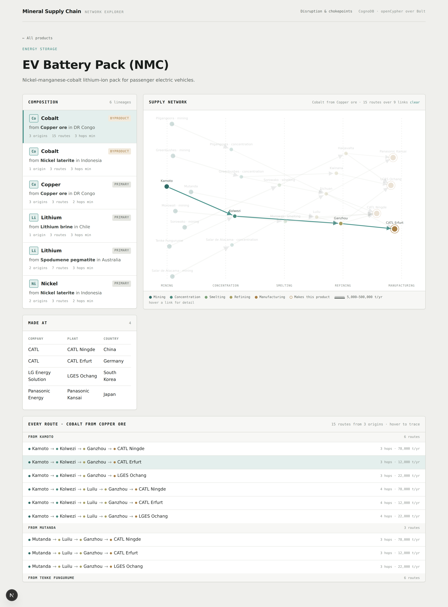
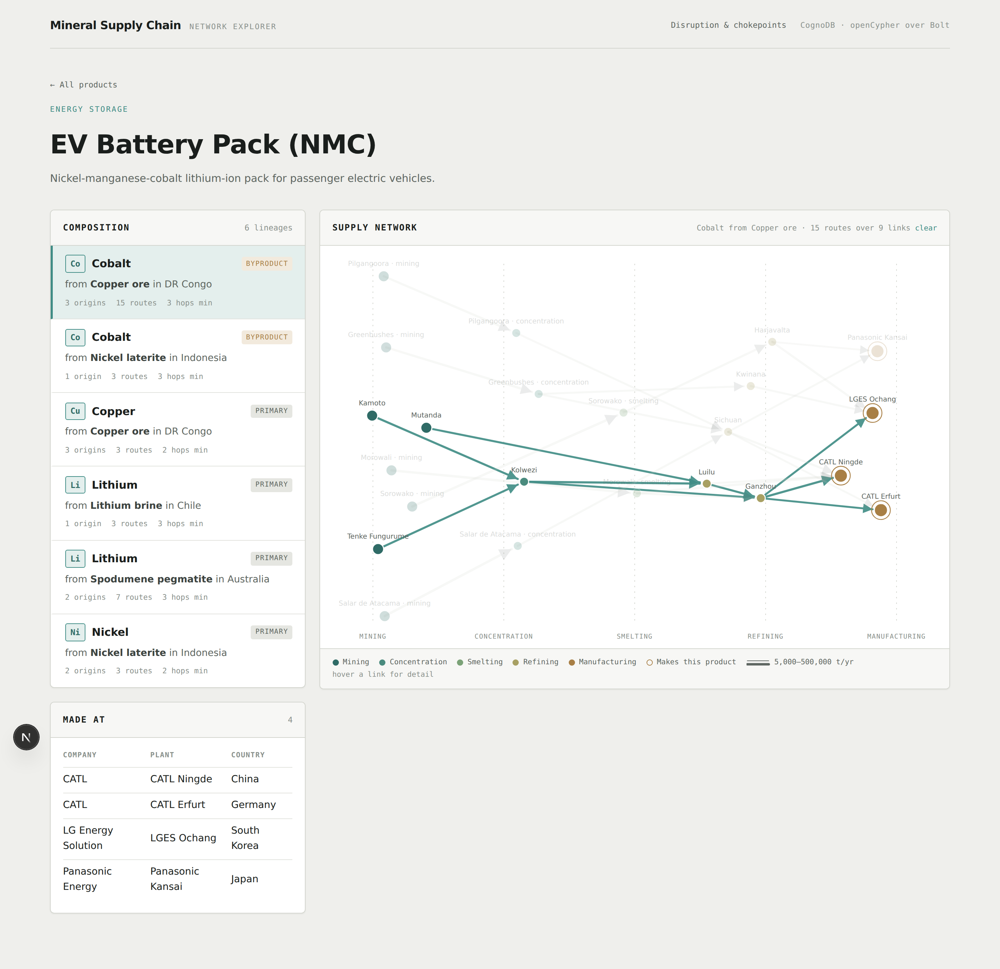
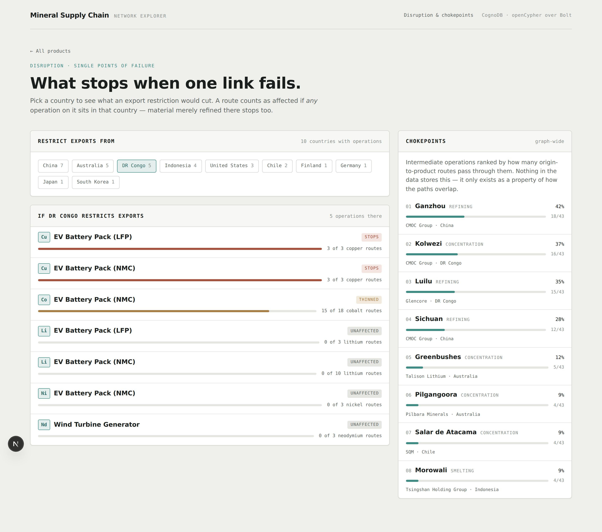
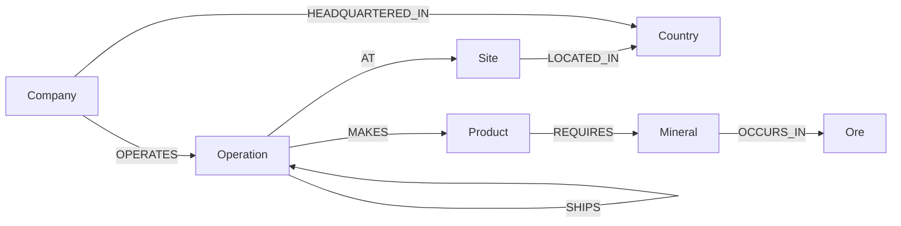

# Mineral Supply Chain Network

Trace the critical minerals in a finished product back to the orebody they came from, and work out what stops when one link in the chain fails.

Built on CognoDB, a managed graph database that speaks openCypher over Bolt.

## The problem

An electric vehicle battery contains cobalt, nickel, lithium and copper. None of those arrive as metal. They come out of the ground as ore, get concentrated, smelted and refined through a chain of facilities in different countries, and only then reach a battery plant. By the time the pack is assembled the material has passed through four or five separate companies on three continents.

Nobody keeps a single record of that journey. Each company knows its own suppliers and its own customers, and nothing joins those fragments end to end. So when a government restricts exports, or a refinery goes offline, the honest answer to "what does this break" is usually a week of phone calls.

The questions that matter are questions about routes:

* Where did the cobalt in this battery actually come from?
* If Congo restricts exports next month, which products stop and which merely slow down?
* Which single facility, if it went offline, would cut the most supply lines at once?

None of those can be answered by looking at one row of anything. They are answered by walking the connections, and that is what this application does.

I trained as a mining engineer, which is why the model draws its lines where it does. A concentrator is not a smelter. Cobalt is not mined on its own, it comes out of copper and nickel ore as a byproduct. Material blends the moment it reaches a refinery, so tracing a single batch past that point is fiction rather than caution. Details like these decide whether an answer is useful or only plausible, so they shape the schema instead of sitting in a footnote.

### One framing decision shaped everything else

This models the **network**, not the inventory.

The graph records which supply routes exist and how much flows along them. It does not try to track individual batches. That is deliberate. Material is commingled and blended at every refining stage, so there is no atom level lineage to recover, and pretending otherwise would build a precision into the app that does not exist in the world. The industry accounts at flow level and the public data exists at flow level, so the model does too.

Think of it like an airline route network. You model airports and routes with capacities, not individual passengers, and you can still answer everything worth asking.

## Walking through it

### Start with a product

Pick a product and the app traces every route back to a mine.



The composition panel on the left is the answer in plain terms: this battery contains cobalt recovered as a byproduct of copper ore in Congo, cobalt from nickel laterite in Indonesia, lithium from Australian spodumene and from Chilean brine, and so on. Six lineages, thirty four routes, twenty three operations involved.

Notice cobalt appears twice. That is not a duplicate. Cobalt reaches this battery by two completely separate supply lines with different geology, different recovery processes and different political exposure. Most sources would record "cobalt" once and lose that distinction.

### Follow a single route

Click a lineage and the graph highlights it. Every route is also listed underneath, spelled out site by site and grouped by where it starts.



That list exists because "fifteen routes" is accurate but not much use on its own. Fifteen paths run over only nine distinct links, since routes overlap heavily, so you cannot count them by eye. Grouping by origin makes the summary numbers legible: three origin groups, six plus three plus six routes, shortest chain three hops. Hovering any row spotlights that one chain in the graph so you can follow it from mine to factory.

### Then break something

Pick a country and see what an export restriction would cut.



The result splits into what stops completely and what only thins out, because those are very different problems. On the seeded data, a Congo restriction stops copper supply to both battery packs dead, while cobalt to the NMC pack is merely reduced, since the Indonesian line keeps running.

The chokepoint panel ranks every intermediate facility by how many routes pass through it. Ganzhou comes out on top at 42 percent, which is the kind of thing you want to know before it becomes a headline.

## Why a graph database

The honest version of this answer has two halves, because not every screen here needs a graph.

**What a relational database could do, awkwardly.** Product composition walks from a mining operation to a factory. The number of hops varies between two and seven depending on the route, so in SQL it is a recursive CTE. It works. It is just unpleasant to read and unpleasant to change.

**What is genuinely hard without one.** Three findings from the seeded data, none of which are stored anywhere, all of which exist only as properties of how paths overlap.

*Cobalt reaches the same battery by two separate lineages.* Fifteen routes carry cobalt recovered from Congolese copper ore. Three carry cobalt from Indonesian nickel laterite. A production table records the word "cobalt" once. Only the paths tell you there are two supply lines and that one survives if the other is cut.

*A Congo export restriction cuts a product that contains no cobalt.* Filter products by "requires cobalt" and you get the NMC pack. But Luilu, in Congo, is the only copper refinery reaching any plant in this graph, and the LFP pack requires copper. So the LFP pack stops dead while the NMC pack's cobalt is only thinned. Wrong product, wrong mineral, wrong severity. The right answer comes from asking which operations sit in that country and what lies downstream of them, which is a question about nodes in the middle of the chain that no product and no mine has a direct relationship with.

*Every gram of cobalt passes through one refinery.* Ganzhou sits on 18 of 43 traced routes, taking from both lineages before splitting out to three of the four battery plants. Take it offline and all cobalt supply stops at once, from both sources. That fact is written nowhere. It appears only when you count how many origin to product paths run through each node, and it changes the moment anyone reroutes a shipment.

## Data model

Five node labels and eight relationship types.



| Label | What it is | Key properties |
|---|---|---|
| `Site` | A physical place | `id`, `name` |
| `Operation` | One process unit at a site | `id`, `type`, `capacity`, `status` |
| `Company` | The legal entity | `id`, `name`, `hq_country` |
| `Ore` | What comes out of the ground | `id`, `name`, `description` |
| `Mineral` | The recovered metal | `id`, `name`, `symbol`, `criticality` |
| `Product` | The finished good | `id`, `name`, `category` |
| `Country` | Jurisdiction | `id` (ISO 3166-1 alpha-2), `name`, `region` |

`Operation.type` is one of `mining`, `concentration`, `smelting`, `refining`, `manufacturing`. The `SHIPS` relationship carries `ores[]`, `minerals[]`, `form[]`, `tonnage` and a `stream_id`.

### Three decisions worth explaining

**A site and an operation are different things.** Kolwezi is a place. The concentrator at Kolwezi is a process unit. Greenbushes both mines and concentrates on the same ground, so it gets two `Operation` nodes and an internal `SHIPS` edge between them. Seven of the twenty two sites work this way.

This buys three things. Origins become a one word rule, since `type: 'mining'` is always the start of a chain. Chokepoint analysis gets sharper, because in a real disruption it is usually one process unit that fails rather than a whole complex. And joint ventures with different ownership per unit are expressible, since `OPERATES` hangs off the operation rather than the site.

**A manufacturer is a company, not a kind of node.** Glencore, CMOC and CATL are all companies. They just run different kinds of sites. Merging them means "who makes this product" is derived by traversal rather than stored, which gives you the specific plant instead of only the company name. It also makes vertical integration askable: CMOC operates a mine, a concentrator and two refineries across Congo and China, which is the concentration that actually matters in critical minerals. Under separate `Mine` and `Manufacturer` labels there was no node type spanning them, so that question had nowhere to start.

**The ore travels the whole chain, the mineral does not.** This is the idea everything else rests on.

When copper ore is processed, cobalt comes out. The mineral on a `SHIPS` edge changes at the concentrator. But the ore it came from never changes. So provenance is an intersection of the ore lists along every leg of a path, not a rule about which mineral transitions are allowed:

```cypher
reduce(acc = head(relationships(path)).ores, r IN relationships(path) |
       [x IN acc WHERE x IN r.ores]) AS lineageOres
```

That one line handles blending for free. Ganzhou takes Congolese copper ore cobalt and Indonesian nickel laterite cobalt and ships one stream onward carrying both ores. Its outbound edge accepts both traces, but the leg into it from Kolwezi carries only copper ore, so the intersection for that path is copper. The upstream legs do the discriminating and no special case is needed.

## The queries

Every query lives in `lib/queries.ts` as a named constant. The Cypher is never built by string concatenation and every value arrives through a parameters object.

**Product composition.** Given a product, which minerals it contains and where they originated. Returns one row per `(mineral, ore)` lineage rather than per mineral, because cobalt from Congolese copper ore and cobalt from Indonesian nickel laterite are different supply lines and collapsing them would throw away the distinction the model exists to capture. The bill of materials is collected first and applied as a path predicate before the unwinds, so paths delivering nothing the product needs are cut before they multiply out into rows.

**Route listing.** The same traversal returned as individual chains rather than aggregated, so each route can be read and highlighted on its own.

**Country disruption.** Given a country, what stops. A route counts as affected if any operation on it sits in that country, not only its origin, because material merely refined there is cut too when exports stop. The result splits into severed, where every route for a mineral runs through the country, and thinned, where some survive elsewhere. A binary answer would have reported Congo as catastrophic for cobalt when it is actually partial, and missed the copper cut entirely.

**Chokepoint ranking.** Which intermediate operation carries the most origin to product routes. CognoDB ships no graph algorithms library, so there is no betweenness centrality to call. This unwinds the nodes of every traced path and counts. Mining and manufacturing operations are excluded, since they always sit at the ends of their own paths and would rank meaninglessly high.

## What the data says

Seeded from the USGS Mineral Commodity Summaries 2026, using the 2025 estimated column for country level production. Operation level tonnages are plausible allocations rather than USGS figures, which the seed file notes.

The graph holds 91 nodes and 50 relationships: 22 sites, 30 operations, 13 companies, 13 countries, 5 ores, 5 minerals, 3 products, 35 shipping routes.

**EV Battery Pack (NMC)**, 34 traced routes across 23 operations:

| Mineral | From | Origin | Routes |
|---|---|---|---|
| Cobalt | Copper ore | DR Congo | 15 |
| Cobalt | Nickel laterite | Indonesia | 3 |
| Copper | Copper ore | DR Congo | 3 |
| Lithium | Spodumene pegmatite | Australia | 7 |
| Lithium | Lithium brine | Chile | 3 |
| Nickel | Nickel laterite | Indonesia | 3 |

**If DR Congo restricts exports:**

| Product | Mineral | Effect |
|---|---|---|
| EV Battery Pack (LFP) | Copper | Stops, 3 of 3 routes |
| EV Battery Pack (NMC) | Copper | Stops, 3 of 3 routes |
| EV Battery Pack (NMC) | Cobalt | Thinned, 15 of 18 routes |
| Everything else | | Unaffected |

**If China restricts exports**, five of the seven product and mineral lines stop completely, including all cobalt and all LFP lithium. China mines almost none of this material. It refines it.

**Chokepoints**, by share of the 43 traced routes passing through:

| Operation | Type | Country | Routes |
|---|---|---|---|
| Ganzhou | Refining | China | 18 of 43 (42%) |
| Kolwezi | Concentration | DR Congo | 16 of 43 (37%) |
| Luilu | Refining | DR Congo | 15 of 43 (35%) |
| Sichuan | Refining | China | 12 of 43 (28%) |

## Running it

```bash
npm install
cp .env.example .env.local   # fill in the three CognoDB values
node probe.js               # capability check, run this first
node scripts/seed.js        # validates locally, then writes
npm run dev
```

Connection details come from `COGNODB_URI`, `COGNODB_USER` and `COGNODB_PASSWORD`. `.env.local` is gitignored and no credential is committed anywhere in this repository.

`GET /api/health` reports whether the database is reachable and how many nodes are seeded, which tells you in one request whether a problem is the database, the credentials or the interface.

The seed script validates the data before it opens a connection, so a data error costs nothing. It is idempotent, so re-run it as often as you like while editing `data/seed.json`.

`probe.js` is worth running first because CognoDB implements a subset of Cypher. It found three things that changed how the code is written: `MERGE` keyed on list valued relationship properties is not idempotent, so the seed keys on a scalar `stream_id` instead; `any(x IN list WHERE ...)` does not filter correctly, so every membership test uses `size([x IN list WHERE ...]) > 0`; and there is no graph algorithms library, so the chokepoint ranking is hand rolled. The probe creates its own throwaway labels and deletes them afterwards.

## What this deliberately does not do

**No batch or lot tracking.** A batch is a manufacturing time grouping, not a provenance grouping. Units from one batch can have different ancestry, and commingling destroys physical lineage anyway. Modelling it would imply a precision that does not exist.

**No tonnage weighted attribution.** The app reports how many routes reach a product, not what share of the material each carries. Doing that properly needs split ratios computed at every node, and once a `SHIPS` edge carries two ore lineages its tonnage stops being attributable to either. Route counts are the honest thing to show at this fidelity.

**The bill of materials is a whitelist.** `REQUIRES` exists because CATL Ningde builds both NMC and LFP packs from a shared pool of incoming material, and a `SHIPS` edge points at the plant rather than at a production line inside it. Without it the LFP pack reported cobalt and nickel, which it contains none of. The weakness is that it filters after traversal, so a mineral genuinely used but missing from the list would silently vanish. The seed script refuses to run if a product has no entries at all, but it cannot catch a partial list.

**Ore and mineral are two levels where strictly there are three.** An ore contains minerals such as chalcopyrite, from which elements such as copper are recovered. This collapses that into ore and recovered metal. Fine for the questions being asked here, but a simplification rather than an oversight.

**No `(Product)-[:CONTAINS]->(Mineral)` shortcut.** Composition is derived by traversal every time. Storing the answer would turn the headline query into a table lookup and remove the reason for using a graph at all.

## Sources

Country level production figures come from the [USGS Mineral Commodity Summaries 2026](https://pubs.usgs.gov/publication/mcs2026), using the 2025 estimated column. Facility names and ownership come from company reporting. Operation level tonnage splits within a country are my own plausible allocations rather than published figures, and the seed file says so.