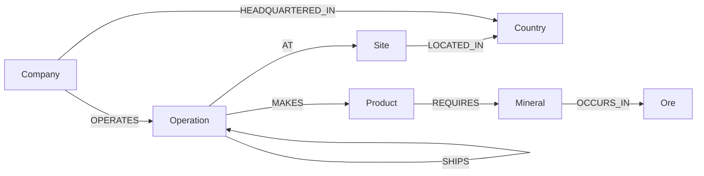

# Mineral Supply Chain Network

Trace the critical minerals in a finished product back to the orebody they came from, and work out what stops when one link in the chain fails.

Built on CognoDB, a managed graph database that speaks openCypher over Bolt.

## The problem

An electric vehicle battery contains cobalt, nickel, lithium and copper. None of those arrive as metal. They come out of the ground as ore, get concentrated, smelted and refined through a chain of facilities in different countries, and only then reach a battery plant. By the time the pack is assembled the material has passed through four or five separate companies on three continents.

Nobody keeps a single record of that journey. Each company knows its own suppliers and its own customers, and nothing joins those fragments end to end. So when a government restricts exports, or a refinery goes offline, the honest answer to "what does this break" is usually a week of phone calls.

The questions that matter are questions about routes:

* Where did the cobalt in this battery actually come from?
* If Congo restricts exports next month, which products stop and which merely slow down?
* Which single facility, if it went offline, would cut the most supply lines at once?

None of those can be answered by looking at one row of anything. They are answered by walking the connections, and that is what this application does.

I trained as a mining engineer, which is why the model draws its lines where it does. A concentrator is not a smelter. Cobalt is not mined on its own, it comes out of copper and nickel ore as a byproduct. Material blends the moment it reaches a refinery, so tracing a single batch past that point is fiction rather than caution. Details like these decide whether an answer is useful or only plausible, so they shape the schema instead of sitting in a footnote.

### One framing decision shaped everything else

This models the **network**, not the inventory.

The graph records which supply routes exist and how much flows along them. It does not try to track individual batches. That is deliberate. Material is commingled and blended at every refining stage, so there is no atom level lineage to recover. The industry accounts at flow level and the public data exists at flow level, and that's the aim of this model.

Think of it like an airline route network. You model airports and routes with capacities, not individual passengers, and you can still answer everything worth asking.

## Walking through it

### Start with a product

Pick a product and the app traces every route back to a mine.


The composition panel on the left gives the answer in simple terms: this battery contains cobalt recovered as a byproduct of copper ore in Congo, cobalt from nickel laterite in Indonesia, lithium from Australian spodumene and Chilean brine, and so on. Altogether, there are six lineages, 34 routes, and 23 operations involved.

Notice that cobalt appears twice. That isn’t a duplicate. Cobalt reaches this battery through two completely separate supply lines, with different geology, recovery processes, and political exposure.

### Follow a single route

Click a lineage and the graph highlights it. Every route is also listed underneath, spelled out site by site and grouped by where it starts.


The list is there because saying “fifteen routes” on its own doesn’t tell you much. Those 15 routes actually run across just nine distinct links, with a lot of overlap, so the total isn’t easy to make sense of at a glance. Grouping them by origin makes the numbers clearer: three origin groups with six, three, and six routes respectively, and the shortest chain is three hops. Hovering over a row also highlights that specific chain in the graph, making it easier to follow the route from the mine to the factory.

### Then break something

Pick a country and see what an export restriction would cut.


The result separates what stops completely from what is only reduced, because those are two very different problems. In the seeded data, a restriction in Congo cuts off copper supply to both battery packs entirely, while cobalt supply to the NMC pack is only reduced because the Indonesian line continues to operate.

The chokepoint panel ranks each intermediate facility by the share of routes that pass through it. Ganzhou comes out on top at 42 percent, which is exactly the kind of exposure you want to know about before it becomes a headline.

## Why a graph database

The honest answer has two parts, because not everything on this screen needs a graph.

**What a relational database could do, awkwardly.** Product composition follows a path from a mining operation to a factory. The number of hops varies from two to seven depending on the route, so in SQL, you would need a recursive CTE. It works, but it is difficult to read and even harder to change.

**What is genuinely difficult without one.** Three findings from the seeded data are not stored anywhere. They emerge entirely from the way the paths overlap.

*Cobalt reaches the same battery through two separate lineages.* Fifteen routes carry cobalt recovered from Congolese copper ore, while three carry cobalt from Indonesian nickel laterite. A production table can record the word “cobalt” once, but only the paths reveal that there are two distinct supply lines and that one can continue if the other is disrupted.

*A Congo export restriction can cut a product that contains no cobalt.* If you filter products by “requires cobalt,” you get the NMC pack. But Luilu in Congo is the only copper refinery supplying any plant in this graph, and the LFP pack requires copper. So the LFP pack stops completely, while cobalt supply to the NMC pack is only reduced. Wrong product, wrong mineral, wrong severity. The right answer comes from asking which operations are in that country and what sits downstream of them—a question about intermediate nodes that neither the product nor the mine has a direct relationship with.

*Every gram of cobalt passes through one refinery.* Ganzhou sits on 18 of 43 traced routes, taking material from both lineages before splitting it across three of the four battery plants. Take it offline and all cobalt supply stops at once, regardless of which source it came from. That fact is written nowhere. It emerges only when you count how many origin-to-product paths pass through each node, and it changes as soon as someone reroutes a shipment.


## Data model

Five node labels and eight relationship types.



| Label | What it is | Key properties |
|---|---|---|
| `Site` | A physical place | `id`, `name` |
| `Operation` | One process unit at a site | `id`, `type`, `capacity`, `status` |
| `Company` | The legal entity | `id`, `name`, `hq_country` |
| `Ore` | What comes out of the ground | `id`, `name`, `description` |
| `Mineral` | The recovered metal | `id`, `name`, `symbol`, `criticality` |
| `Product` | The finished good | `id`, `name`, `category` |
| `Country` | Jurisdiction | `id` (ISO 3166-1 alpha-2), `name`, `region` |

`Operation.type` is one of `mining`, `concentration`, `smelting`, `refining`, `manufacturing`. The `SHIPS` relationship carries `ores[]`, `minerals[]`, `form[]`, `tonnage` and a `stream_id`.

### Three decisions worth explaining

**A site and an operation are different things.** Kolwezi is a place; the concentrator at Kolwezi is a process unit. Greenbushes both mines and concentrates on the same site, so it gets two `Operation` nodes connected by an internal `SHIPS` edge. Seven of the 22 sites work this way.

This gives us three useful things. First, origins become a simple rule: `type: 'mining'` always marks the start of a chain. Second, chokepoint analysis becomes more precise, because in a real disruption, it is usually a particular process unit that fails rather than an entire complex. Third, joint ventures with different ownership at different units can be represented, since `OPERATES` belongs to the operation rather than the site.

**A manufacturer is a company, not a kind of node.** Glencore, CMOC, and CATL are all companies; they simply operate different kinds of sites. Keeping the company separate from the site means “who makes this product?” can be derived through traversal rather than stored directly, giving you the specific plant rather than just the company name.

It also makes vertical integration something we can actually ask about. CMOC, for example, operates a mine, a concentrator, and two refineries across Congo and China. That concentration is what matters when you're looking at critical-mineral exposure. With separate `Mine` and `Manufacturer` labels, there was no common node type across those operations, so there was nowhere to start that question.

**The ore travels through the whole chain; the mineral does not.** This is the idea everything else rests on.

When copper ore is processed, cobalt can be recovered from it. The mineral represented on a `SHIPS` edge can therefore change at the concentrator, but the ore it came from does not. Provenance is consequently the intersection of the ore lists across every leg of a path, rather than a rule about which mineral transitions are allowed:

```cypher
reduce(acc = head(relationships(path)).ores, r IN relationships(path) |
       [x IN acc WHERE x IN r.ores]) AS lineageOres
```

That one line handles blending naturally. Ganzhou receives cobalt from both Congolese copper ore and Indonesian nickel laterite, then ships a combined stream onward carrying both ore traces. Its outbound edge can therefore carry both traces, while the leg from Kolwezi carries only copper ore. The intersection for that path is consequently just copper.

The upstream legs do the filtering, so no special case is needed for blending.


## The queries

Every query lives in `lib/queries.ts` as a named constant. The Cypher is never built through string concatenation, and every value is passed through a parameters object.

**Product composition.** Given a product, this query finds which minerals it contains and where they originated. It returns one row for each `(mineral, ore)` lineage rather than one row per mineral. That distinction matters: cobalt from Congolese copper ore and cobalt from Indonesian nickel laterite represent two different supply lines, and collapsing them would lose exactly the distinction this model is designed to capture. The bill of materials is collected first and used as a path predicate before the results are unwound, so paths that deliver nothing the product needs are filtered out before they multiply into rows.

**Route listing.** This uses the same traversal but returns the paths individually rather than aggregating them. That means each route can be read on its own and highlighted independently in the graph.

**Country disruption.** Given a country, this query determines what supply is affected. A route counts as affected if any operation along it is located in that country, not just the origin. That matters because material being refined in a country is still exposed if exports from that country stop. The result is split into *severed*, where every route for a mineral passes through the country, and *thinned*, where some routes remain available elsewhere. A simple binary answer would make Congo look catastrophic for cobalt when the actual impact is partial, while also missing the complete loss of copper supply.

**Chokepoint ranking.** This asks which intermediate operation carries the most origin-to-product routes. CognoDB does not provide a graph-algorithms library, so there is no betweenness centrality function to call. Instead, the query unwinds the nodes on every traced path and counts how often each intermediate operation appears. Mining and manufacturing operations are excluded because they sit at the ends of their own paths and would otherwise rank artificially high.

## What the data says

Seeded from the USGS Mineral Commodity Summaries 2026, using the 2025 estimated column for country level production. Operation level tonnages are plausible allocations rather than USGS figures, which the seed file notes.

The graph holds 91 nodes and 50 relationships: 22 sites, 30 operations, 13 companies, 13 countries, 5 ores, 5 minerals, 3 products, 35 shipping routes.

**EV Battery Pack (NMC)**, 34 traced routes across 23 operations:

| Mineral | From | Origin | Routes |
|---|---|---|---|
| Cobalt | Copper ore | DR Congo | 15 |
| Cobalt | Nickel laterite | Indonesia | 3 |
| Copper | Copper ore | DR Congo | 3 |
| Lithium | Spodumene pegmatite | Australia | 7 |
| Lithium | Lithium brine | Chile | 3 |
| Nickel | Nickel laterite | Indonesia | 3 |

**If DR Congo restricts exports:**

| Product | Mineral | Effect |
|---|---|---|
| EV Battery Pack (LFP) | Copper | Stops, 3 of 3 routes |
| EV Battery Pack (NMC) | Copper | Stops, 3 of 3 routes |
| EV Battery Pack (NMC) | Cobalt | Thinned, 15 of 18 routes |
| Everything else | | Unaffected |

**If China restricts exports**, five of the seven product and mineral lines stop completely, including all cobalt and all LFP lithium. China mines almost none of this material. It refines it.

**Chokepoints**, by share of the 43 traced routes passing through:

| Operation | Type | Country | Routes |
|---|---|---|---|
| Ganzhou | Refining | China | 18 of 43 (42%) |
| Kolwezi | Concentration | DR Congo | 16 of 43 (37%) |
| Luilu | Refining | DR Congo | 15 of 43 (35%) |
| Sichuan | Refining | China | 12 of 43 (28%) |

## Running it

```bash
npm install
cp .env.example .env.local   # fill in the three CognoDB values
node probe.js               # capability check, run this first
node scripts/seed.js        # validates locally, then writes
npm run dev
```

Connection details come from `COGNODB_URI`, `COGNODB_USER` and `COGNODB_PASSWORD`. `.env.local` is gitignored and no credential is committed anywhere in this repository.

`GET /api/health` reports whether the database is reachable and how many nodes are seeded, which tells you in one request whether a problem is the database, the credentials or the interface.

The seed script validates the data before it opens a connection, so a data error costs nothing. It is idempotent, so re-run it as often as you like while editing `data/seed.json`.

`probe.js` is worth running first because CognoDB implements a subset of Cypher. It found three things that changed how the code is written: `MERGE` keyed on list valued relationship properties is not idempotent, so the seed keys on a scalar `stream_id` instead; `any(x IN list WHERE ...)` does not filter correctly, so every membership test uses `size([x IN list WHERE ...]) > 0`; and there is no graph algorithms library, so the chokepoint ranking is hand rolled. The probe creates its own throwaway labels and deletes them afterwards.

## What this deliberately does not do

**No batch or lot tracking.** A batch is a manufacturing time grouping, not a provenance grouping. Units from the same batch can have different ancestry, and once materials are commingled, their physical lineage is no longer knowable. Modelling batches would therefore imply a level of precision the data does not actually support.

**No tonnage-weighted attribution.** The app reports how many routes reach a product, not what share of the material each route carries. Doing that properly would require split ratios at every node, and once a `SHIPS` edge carries two ore lineages, the tonnage is no longer attributable cleanly to either one. At this level of fidelity, route counts are the more honest measure.

**The bill of materials is a whitelist.** `REQUIRES` exists because CATL Ningde builds both NMC and LFP packs from a shared pool of incoming material, while a `SHIPS` edge points to the plant rather than to a specific production line. Without `REQUIRES`, the LFP pack would incorrectly report cobalt and nickel, even though it contains neither. The weakness is that the filter is applied after traversal, so a mineral that is genuinely used but missing from the list would simply disappear. The seed script refuses to run when a product has no entries at all, but it cannot detect a partially incomplete list.

**Ore and mineral are two levels where, strictly speaking, there are three.** An ore contains minerals such as chalcopyrite, from which elements such as copper are recovered. The model collapses this into ore and recovered metal. That is sufficient for the questions being asked here, but it is a simplification rather than an oversight.

**No `(Product)-[:CONTAINS]->(Mineral)` shortcut.** Composition is derived through traversal every time. Storing the answer would turn the main query into a table lookup and remove much of the reason for using a graph in the first place.


## Sources

Country level production figures come from the [USGS Mineral Commodity Summaries 2026](https://pubs.usgs.gov/publication/mcs2026), using the 2025 estimated column. Facility names and ownership come from company reporting. Operation level tonnage splits within a country are my own plausible allocations rather than published figures, and the seed file says so.